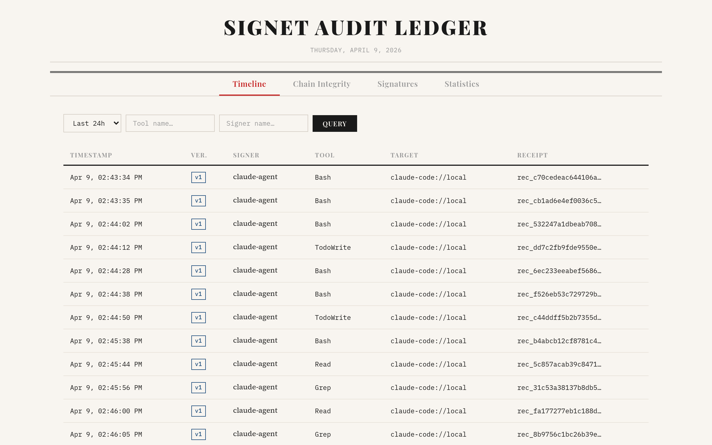
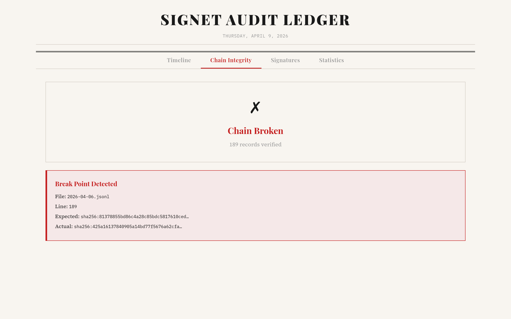

<h1 align="center">Signet</h1>

<p align="center">
  <strong>你的 Agent 跑在别人的基础设施上。证明归你所有。</strong><br/>
  <sub>每次工具调用生成密码学证据 —— 签名、哈希链、可离线验证。独立于任何平台和厂商。</sub>
</p>

[](https://github.com/Prismer-AI/signet/actions/workflows/ci.yml)
[](https://github.com/Prismer-AI/signet/releases/latest)
[](https://crates.io/crates/signet-core)
[](https://pypi.org/project/signet-auth/)
[](https://www.npmjs.com/org/signet-auth)
[](LICENSE-APACHE)
[](https://github.com/Prismer-AI/signet/stargazers)

TypeScript 包：
[`@signet-auth/core`](https://www.npmjs.com/package/@signet-auth/core) ·
[`@signet-auth/mcp`](https://www.npmjs.com/package/@signet-auth/mcp) ·
[`@signet-auth/mcp-server`](https://www.npmjs.com/package/@signet-auth/mcp-server) ·
[`@signet-auth/mcp-tools`](https://www.npmjs.com/package/@signet-auth/mcp-tools) ·
[`@signet-auth/vercel-ai`](https://www.npmjs.com/package/@signet-auth/vercel-ai)

[](README.md)
[](README.zh.md)

<p align="center">
  <a href="https://www.youtube.com/watch?v=7OiGV_pyZas">
    
  </a>
</p>

<p align="center">
  <sub><a href="https://www.youtube.com/watch?v=7OiGV_pyZas">▶ 观看：Signet 如何签名和验证 AI Agent 工具调用（2 分钟）</a></sub>
</p>

**AI Agent 已经能调用 Bash、GitHub、云 API，甚至支付系统。但大多数团队仍然无法证明：Agent 当时到底发了什么、是谁授权它这么做、以及执行前检查的是哪条策略。**

Signet 把 Agent 行为变成可携带、可校验、可离线验证的密码学证据——是你自己持有的证据，而不是平台方代你持有的日志。

平台记录了发生了什么。Signet 证明它发生了。当审计员需要独立验证、当事故发生在你不改属的基础设施上、或者“相信控制台日志”不足以作为答案时——这个区别就很重要。

每个 Agent 都有自己的 Ed25519 身份。每次工具调用都可以被签名、写入哈希链审计日志、在离线或执行前验证、由服务端联合签名、附带 delegation chain，并在需要时绑定到一条策略决策上。

如果 Signet 对你有帮助，[点个 Star](https://github.com/Prismer-AI/signet) 让更多人发现它。

上面的视频展示完整流程。下面这张 SVG 展示 CLI 签名的细节，也可以跳到 [看它如何拒绝非法请求](#execution-boundary-demo) 看服务端如何拦住非法请求。

<p align="center">
  
</p>

<p align="center">
  <sub>这个 demo 展示签名与审计收据。也可以查看 <a href="./demo-mcp.svg">MCP 流程示意图</a>。</sub>
</p>

## Signet 增加了什么

Signet 为 Agent 行为增加一层轻量但可验证的信任层：

- **签名**：用 Agent 的密码学密钥签名每次工具调用
- **验证**：在离线或执行边界验证请求，再决定是否信任
- **透明代理**：用 `signet proxy` 拦在任意 MCP Server 前面，无需改动 Agent 或 Server 代码
- **联合签名**：当你控制服务端时，用双边收据记录"Agent 发了什么"以及"服务端返回了什么"
- **追踪链路**：用 `trace_id` 和 `parent_receipt_id` 把多步工作流的收据串成因果链
- **授权证明**：用 delegation chain 证明是谁授权了这个 Agent
- **策略证明**：当 YAML 策略满足时，把签过名的 `PolicyAttestation` 写进收据
- **本地可视化**：通过仅追加的审计日志和 dashboard 查看全链路记录，无需托管控制面

## 0.9 有什么新东西

- **MCP 透明代理**：`signet proxy --target <cmd> --key <name>` — 把 Signet 以 stdio 代理的形式接在任意 MCP Server 前面。Agent 和 Server 无需任何改动。对每个 `tools/call` 自动签名，并对 Server 响应生成双边收据。
- **链路追踪**：在 `Action` 上新增 `trace_id` 和 `parent_receipt_id` 字段，把多步工作流中的收据串成因果链。两个字段都纳入签名范围 — 篡改任意一个，签名即失效。
- **策略引擎**：`signet sign --policy policy.yaml` 会在签名前先执行策略检查，并把决策绑定进收据。Proxy 模式同样支持 `--policy`，被拒绝的请求不会到达 Server。
- **委托链**：`signet delegate ...` 生成 v4 收据，证明是谁授权了这个 Agent，以及授予了什么 scope。
- **本地 dashboard**：`signet dashboard` 展示时间线、链完整性、签名健康度，以及 delegated / direct 的分布。
- **更完整的集成面**：官方 Claude Code 插件、Codex 插件、MCP 中间件、Python SDK 和 Vercel AI SDK callbacks。

## 30 秒体验

```bash
pip install signet-auth
```

```python
from signet_auth import SigningAgent

agent = SigningAgent.create("my-agent", owner="team")
receipt = agent.sign("github_create_issue", params={"title": "fix bug"})

assert agent.verify(receipt)
print(receipt.id)
```

如果你是第一次接触 Signet，建议先从下面五条入口里选一条：

## 选择你的入口

- [**Claude Code**](#claude-code-plugin)：最适合最快跑通第一次体验。在 Claude Code 中运行 `/plugin install signet@claude-plugins-official`。5 分钟后你会得到自动签名的工具调用，以及写入 `~/.signet/audit/` 的本地审计日志。
- [**Codex CLI**](#codex-plugin)：最适合给 Codex 的 Bash 工具调用补签名。把 `plugins/codex/` 复制到 `~/.codex/plugins/signet`，再加一个 `PostToolUse` hook。5 分钟后你会得到写入同一条 Signet 审计轨迹的 Codex Bash 行为记录。
- [**Python SDK**](#python-sdk)：最适合把收据接到 LangGraph、LlamaIndex、OpenAI Agents、CrewAI 或你自己的工具执行器里。先从 `SigningAgent.create(...)` 开始，再按需接入框架 hooks。
- [**MCP 客户端**](#mcp-client-integration)：最适合你已经控制 MCP client 或 transport 的情况。用 `new SigningTransport(inner, secretKey, "my-agent")` 包住 transport。5 分钟后你会得到带 `params._meta._signet` 收据的签名 `tools/call` 请求。
- [**MCP 服务端**](#mcp-server-verification)：最适合你希望在执行前做验证。先在处理函数里调用 `verifyRequest(request, {...})`。5 分钟后你会得到发生在执行边界的服务端校验：签名者、freshness、target binding，以及 tool/params match。

<a id="execution-boundary-demo"></a>
## 看它如何拒绝非法请求

运行最短的 execution-boundary demo：

```bash
cd examples/mcp-agent
npm run execution-boundary-demo
```

<p align="center">
  
</p>

<p align="center">
  <sub>想看动态版？这里有 <a href="./demo-execution-boundary.mp4">MP4</a> 和 <a href="./demo-execution-boundary.gif">GIF</a>。</sub>
</p>

demo 源码见 [examples/mcp-agent/demo-execution-boundary.mjs](./examples/mcp-agent/demo-execution-boundary.mjs)。

<a id="delegation-chains"></a>
## 委托链：这个 Agent 是谁授权的？

Signet 收据证明的是 **发生了什么**。委托链证明的是 **谁允许它发生**。

一个根身份（人或组织）可以用密码学方式把受限权限委托给 Agent。权限只能收窄，不能放大。Agent 生成的 v4 收据会携带完整的授权证明。

```text
Owner (alice) → Agent A (tools: [Bash, Read], max_depth: 0)
                    ↓
              v4 收据：tool=Bash，authorization.chain 证明 alice → Agent A
```

```bash
# 创建 delegation token
signet delegate create --from alice --to deploy-bot --to-name deploy-bot \
    --tools Bash,Read --targets "mcp://github" --max-depth 0

# 带授权证明签名（v4 收据）
signet delegate sign --key deploy-bot --tool Bash \
    --params '{"cmd":"git pull"}' --target "mcp://github" --chain chain.json

# 验证：签名 + chain + scope + root trust
signet delegate verify-auth receipt.json --trusted-roots alice
```

或者在 Python 中：

```python
from signet_auth import sign_delegation, sign_authorized, verify_authorized

# delegation API 接收 scope、chain、receipt 的 JSON 字符串
token_json = sign_delegation(root_key_b64, "alice", agent_pubkey_b64, "bot", scope_json)
receipt_json = sign_authorized(agent_key_b64, action_json, "bot", f"[{token_json}]")
scope_json = verify_authorized(receipt_json, [root_pubkey_b64])
```

<p align="center">
  
</p>

## 策略证明：这次操作当时被允许了吗？

Signet 可以在签名前执行 YAML 策略检查。若动作被允许，签名收据会携带一个 `PolicyAttestation`，证明当时生效的是哪条策略哈希、命中了哪条规则、最终决策是什么。

```yaml
version: 1
name: production-agents
default_action: deny
rules:
  - id: allow-read
    match:
      tool: Read
    action: allow
  - id: deny-rm-rf
    match:
      tool: Bash
      params:
        command:
          contains: "rm -rf"
    action: deny
    reason: destructive command
```

```bash
signet policy validate policy.yaml
signet policy check policy.yaml --tool Bash --params '{"command":"rm -rf /"}'

signet sign --key deploy-bot --tool Read \
    --params '{"path":"README.md"}' --target "mcp://github" --policy policy.yaml
```

被拒绝的动作会在生成收据前直接失败。被允许的动作会产生一个收据，且它的签名 payload 会证明这次策略决策确实发生过。

## 什么时候该用 Signet

- 你需要为 coding agent、MCP 工具调用或 CI 自动化补上一条防篡改审计轨迹
- 你希望在事故发生后，证明到底是哪个 Agent 发起了哪个动作，以及是谁授权它这么做
- 你需要可离线验证的收据，而不是依赖某个托管平台查看日志
- 你想在签名前做轻量策略检查，但不想额外引入 proxy

## Signet 是什么，不是什么

- **Signet 是** 面向 Agent 行为的信任层：签名、审计、验证、委托链和策略证明
- **Signet 是** 可以嵌入现有 Agent 栈的 SDK、插件和 MCP 中间件
- **Signet 可以** 在执行前拒绝未签名、过期、重放或发错目标的 MCP 请求
- **Signet 可以** 在你提供策略文件时，在签名前直接拒绝动作
- **Signet 不是** 托管 gateway、常驻控制面，也不是 sandboxing 或最小权限设计的替代品

## 安装

```bash
# CLI
cargo install signet-cli

# Python
pip install signet-auth

# TypeScript（MCP 中间件）
npm install @signet-auth/core @signet-auth/mcp

# TypeScript（MCP 服务端验证）
npm install @signet-auth/mcp-server

# TypeScript（Vercel AI SDK 中间件）
npm install @signet-auth/vercel-ai

# TypeScript（独立 MCP 签名服务）
npx @signet-auth/mcp-tools
```

## 快速开始

<a id="claude-code-plugin"></a>
### Claude Code Plugin

在 [Claude Code](https://claude.ai/code) 中自动签名每次工具调用，零配置：

```bash
# 方式 A：从 Anthropic 官方插件市场安装
/plugin install signet@claude-plugins-official

# 方式 B：添加 Signet 作为市场源，然后安装
/plugin marketplace add Prismer-AI/signet
/plugin install signet@signet
```

每次工具调用都会用 Ed25519 签名，并记录到 `~/.signet/audit/` 的哈希链审计日志中。

其他安装方式：

```bash
# 从 Git 安装
claude plugin add --from https://github.com/Prismer-AI/signet

# 通过 signet CLI
signet claude install
```

<a id="codex-plugin"></a>
### Codex Plugin

在 [Codex CLI](https://github.com/openai/codex) 中自动签名 Bash 工具调用：

```bash
git clone https://github.com/Prismer-AI/signet.git
cp -r signet/plugins/codex ~/.codex/plugins/signet
```

然后在 `~/.codex/hooks.json` 中添加 hook：

```json
{
  "hooks": {
    "PostToolUse": [{
      "matcher": "Bash",
      "hooks": [{
        "type": "command",
        "command": "node \"$HOME/.codex/plugins/signet/bin/sign.cjs\"",
        "timeout": 5
      }]
    }]
  }
}
```

或使用 MCP Server 接入：

```bash
codex mcp add signet -- npx @signet-auth/mcp-tools
```

### CLI

```bash
# 生成 Agent 身份
signet identity generate --name my-agent

# 签名操作
signet sign --key my-agent --tool "github_create_issue" \
  --params '{"title":"fix bug"}' --target mcp://github.local

# 验证收据
signet verify receipt.json --pubkey my-agent

# 审计最近操作
signet audit --since 24h

# 验证日志完整性
signet verify --chain
```

<a id="mcp-client-integration"></a>
### MCP 客户端集成（TypeScript）

```typescript
import { Client } from "@modelcontextprotocol/sdk/client/index.js";
import { StdioClientTransport } from "@modelcontextprotocol/sdk/client/stdio.js";
import { generateKeypair } from "@signet-auth/core";
import { SigningTransport } from "@signet-auth/mcp";

// 生成 Agent 身份
const { secretKey } = generateKeypair();

// 包装任意 MCP transport — 所有工具调用自动签名
const inner = new StdioClientTransport({ command: "my-mcp-server" });
const transport = new SigningTransport(inner, secretKey, "my-agent");

const client = new Client({ name: "my-agent", version: "1.0" }, {});
await client.connect(transport);

// 每次 callTool() 都会被密码学签名
const result = await client.callTool({
  name: "echo",
  arguments: { message: "Hello!" },
});
```

每次 `tools/call` 请求会在 `params._meta._signet` 中注入签名收据。
未接入 Signet 的 MCP Server 也无需修改 —— 未知字段会被忽略。

<a id="mcp-server-verification"></a>
### MCP 服务端验证（TypeScript）

如果你也控制 MCP 服务端，可以在执行前验证请求：

```typescript
import { verifyRequest } from "@signet-auth/mcp-server";

server.setRequestHandler(CallToolRequestSchema, async (request) => {
  const verified = verifyRequest(request, {
    trustedKeys: ["ed25519:..."],
    maxAge: 300,
  });
  if (!verified.ok) return { content: [{ type: "text", text: verified.error }], isError: true };
  console.log(`验证通过: ${verified.signerName}`);
  // 处理工具调用...
});
```

### 参考 MCP Server

这个仓库还包含一个最小可运行的 MCP reference server，用来演示 `@signet-auth/mcp-server` 的服务端验证：

```bash
cd examples/mcp-agent
npm ci
npm run verifier-server
```

可用工具：

- `inspect_current_request` — 如果当前请求包含 `params._meta._signet`，就验证它
- `verify_receipt` — 用公钥验证原始 Signet 收据
- `verify_request_payload` — 离线验证一个模拟的 MCP `tools/call` payload

环境变量：

- `SIGNET_TRUSTED_KEYS` — 逗号分隔的 `ed25519:<base64>` 公钥列表
- `SIGNET_REQUIRE_SIGNATURE` — `true` 或 `false`（默认 `false`）
- `SIGNET_MAX_AGE` — 收据最大年龄，单位秒（默认 `300`）
- `SIGNET_EXPECTED_TARGET` — 可选的预期 `receipt.action.target`

### 独立 MCP 签名服务

`@signet-auth/mcp-tools` 将 Signet 的签名、验证、内容哈希能力暴露成 MCP 工具，可直接接到任何 MCP-compatible client：

```bash
npx @signet-auth/mcp-tools
```

可用工具：`signet_generate_keypair`、`signet_sign`、`signet_verify`、`signet_content_hash`。

<a id="python-sdk"></a>
### Python SDK（LangChain / CrewAI / AutoGen + 6 more）

```bash
pip install signet-auth
```

```python
from signet_auth import SigningAgent

# 创建 Agent 身份（密钥保存到 ~/.signet/keys/）
agent = SigningAgent.create("my-agent", owner="willamhou")

# 签名任意工具调用 — 收据自动写入审计日志
receipt = agent.sign("github_create_issue", params={"title": "fix bug"})

# 验证
assert agent.verify(receipt)

# 查询审计日志
for record in agent.audit_query(since="24h"):
    print(f"{record.receipt.ts} {record.receipt.action.tool}")
```

#### LangChain 集成

```python
from signet_auth import SigningAgent
from signet_auth.langchain import SignetCallbackHandler

agent = SigningAgent("my-agent")
handler = SignetCallbackHandler(agent)

# 每次工具调用自动签名 + 写入审计日志
chain.invoke(input, config={"callbacks": [handler]})

# 也支持异步链
from signet_auth.langchain import AsyncSignetCallbackHandler
```

#### CrewAI 集成

```python
from signet_auth import SigningAgent
from signet_auth.crewai import install_hooks

agent = SigningAgent("my-agent")
install_hooks(agent)

# 全局签名所有 CrewAI 工具调用
crew.kickoff()
```

#### AutoGen 集成

```python
from signet_auth import SigningAgent
from signet_auth.autogen import signed_tool, sign_tools

agent = SigningAgent("my-agent")

# 包装单个工具
wrapped = signed_tool(tool, agent)

# 或批量包装
wrapped_tools = sign_tools([tool1, tool2], agent)
```

#### LangGraph 集成

LangGraph 使用 LangChain 的 callback 系统，同一个 handler 直接可用：

```python
from signet_auth import SigningAgent
from signet_auth.langgraph import SignetCallbackHandler

agent = SigningAgent("my-agent")
handler = SignetCallbackHandler(agent)

result = graph.invoke(input, config={"callbacks": [handler]})
```

#### LlamaIndex 集成

```python
from signet_auth import SigningAgent
from signet_auth.llamaindex import install_handler

agent = SigningAgent("my-agent")
handler = install_handler(agent)

# 所有工具调用事件自动签名
index = ... # 你的 LlamaIndex 配置
response = index.as_query_engine().query("What is Signet?")

# 访问收据
print(handler.receipts)
```

#### Pydantic AI 集成

```python
from signet_auth import SigningAgent
from signet_auth.pydantic_ai_integration import SignetMiddleware

agent = SigningAgent("my-agent")
middleware = SignetMiddleware(agent)

@middleware.wrap
def my_tool(query: str) -> str:
    return f"result: {query}"
```

#### Google ADK 集成

```python
from signet_auth import SigningAgent
from signet_auth.google_adk import SignetPlugin

agent = SigningAgent("my-agent")
plugin = SignetPlugin(agent)

# 作为 callback 传给 ADK agent
```

#### Smolagents 集成

```python
from signet_auth import SigningAgent
from signet_auth.smolagents import signet_step_callback

agent = SigningAgent("my-agent")
callback = signet_step_callback(agent)

bot = CodeAgent(tools=[...], model=model, step_callbacks=[callback])
```

#### OpenAI Agents SDK 集成

```python
from signet_auth import SigningAgent
from signet_auth.openai_agents import SignetAgentHooks

agent = SigningAgent("my-agent")

oai_agent = Agent(
    name="assistant",
    hooks=SignetAgentHooks(agent),
    tools=[...],
)
```

> **注意：** 工具调用参数目前不在 hook API 中暴露（[issue #939](https://github.com/openai/openai-agents-python/issues/939)），仅签名工具名称。

#### 底层 API

```python
from signet_auth import generate_keypair, sign, verify, Action

kp = generate_keypair()
action = Action("github_create_issue", params={"title": "fix bug"})
receipt = sign(kp.secret_key, action, "my-agent", "willamhou")
assert verify(receipt, kp.public_key)
```

#### 双边收据（服务端联合签名）

```python
from signet_auth import generate_keypair, sign, sign_bilateral, verify_bilateral, Action

# Agent 签名工具调用
agent_kp = generate_keypair()
action = Action("github_create_issue", params={"title": "fix bug"})
agent_receipt = sign(agent_kp.secret_key, action, "my-agent")

# 服务端联合签名响应
server_kp = generate_keypair()
bilateral = sign_bilateral(
    server_kp.secret_key, agent_receipt,
    {"content": [{"type": "text", "text": "issue #42 created"}]},
    "github-server",
)
assert verify_bilateral(bilateral, server_kp.public_key)
assert bilateral.v == 3  # v3 = 双边收据
```

### Vercel AI SDK 集成

```typescript
import { generateText } from "ai";
import { openai } from "@ai-sdk/openai";
import { generateKeypair } from "@signet-auth/core";
import { createSignetCallbacks } from "@signet-auth/vercel-ai";

const { secretKey } = generateKeypair();
const callbacks = createSignetCallbacks(secretKey, "my-agent");

const result = await generateText({
  model: openai("gpt-4o"),
  tools: { myTool },
  ...callbacks,
  prompt: "...",
});

// 每次工具调用都会被签名
console.log(callbacks.receipts);
```

## 工作原理

```
你的 Agent
    |
    v
SigningTransport（包装任意 MCP transport）
    |
    +---> 签名每次工具调用（Ed25519）
    +---> 将操作收据追加到本地审计日志（哈希链接）
    +---> 将请求原样转发给 MCP Server
```

客户端侧签名本身不要求服务端改动。如果你也控制服务端，可以再接入 `verifyRequest()`，并在需要时配合 `signResponse()` 实现执行边界验证与双边收据。

## 操作收据

每次工具调用都会先产生一个签名收据。更高版本的收据会继续增加服务端联合签名（v3）和授权链（v4）：

```json
{
  "v": 1,
  "id": "rec_e7039e7e7714e84f...",
  "action": {
    "tool": "github_create_issue",
    "params": {"title": "fix bug"},
    "params_hash": "sha256:b878192252cb...",
    "target": "mcp://github.local",
    "transport": "stdio"
  },
  "signer": {
    "pubkey": "ed25519:0CRkURt/tc6r...",
    "name": "demo-bot",
    "owner": "willamhou"
  },
  "ts": "2026-03-29T23:24:03.309Z",
  "nonce": "rnd_dcd4e135799393...",
  "sig": "ed25519:6KUohbnSmehP..."
}
```

签名覆盖整个收据体（action + signer + timestamp + nonce），使用 [RFC 8785 (JCS)](https://datatracker.ietf.org/doc/html/rfc8785) 规范化 JSON。篡改任何字段，签名即失效。

## CLI 命令

| 命令 | 说明 |
|------|------|
| `signet identity generate --name <n>` | 生成 Ed25519 身份（默认加密） |
| `signet identity generate --unencrypted` | 不加密生成（用于 CI） |
| `signet identity list` | 列出所有身份 |
| `signet identity export --name <n>` | 导出公钥为 JSON |
| `signet sign --key <n> --tool <t> --params <json> --target <uri>` | 签名操作 |
| `signet sign --hash-only` | 仅存储参数哈希（不存原始参数） |
| `signet sign --output <file>` | 将收据写入文件 |
| `signet sign --no-log` | 跳过审计日志追加 |
| `signet sign --policy <path>` | 签名前执行策略检查，并把 `PolicyAttestation` 写入收据 |
| `signet verify <receipt.json> --pubkey <name>` | 验证收据签名 |
| `signet verify --chain` | 验证审计日志哈希链完整性 |
| `signet audit` | 列出最近操作 |
| `signet audit --since <duration>` | 按时间过滤（如 24h, 7d） |
| `signet audit --tool <substring>` | 按工具名过滤 |
| `signet audit --verify` | 验证所有收据签名 |
| `signet audit --export <file>` | 导出记录为 JSON |
| `signet delegate create ...` | 为另一个 Agent 创建带 scope 的 delegation token |
| `signet delegate sign ... --chain <file>` | 带授权证明签名，并生成 v4 收据 |
| `signet delegate verify-auth <receipt> --trusted-roots <name>` | 验证授权链、scope 和可信根 |
| `signet policy validate <path>` | 校验策略语法并输出策略哈希 |
| `signet policy check <path> --tool <t> --params <json>` | dry-run 某个动作是否会被允许 |
| `signet proxy --target <cmd> --key <name>` | 以 MCP stdio 代理模式运行，透明签名所有工具调用 |
| `signet proxy --target <cmd> --key <n> --policy <path>` | 代理模式 + 签名前策略检查 |
| `signet claude install` | 安装 Claude Code 插件（PostToolUse 签名 hook） |
| `signet claude uninstall` | 卸载 Claude Code 插件 |
| `signet dashboard` | 在浏览器中打开本地审计 dashboard |

密码短语通过交互提示输入，或通过 `SIGNET_PASSPHRASE` 环境变量设置（用于 CI）。

## 审计 Dashboard

运行 `signet dashboard` 打开本地 Web UI 查看审计日志。无需账号，无需联网，直接查看本地 receipts。

<p align="center">
  
</p>

<p align="center">
  <sub>Timeline 视图：展示每次工具调用的 signer、tool、target 和 receipt ID，并支持按时间、工具、签名者过滤。</sub>
</p>

**Chain Integrity** 标签页会验证整条审计日志的 SHA-256 哈希链，并精确指出链断裂发生在哪个文件、哪一行：

<p align="center">
  
</p>

<p align="center">
  <sub>链在第 189 行断裂：界面会直接显示 expected / actual hash。这才是“append-only”在实际里的样子。</sub>
</p>

## 文档

| 文档 | 说明 |
|------|------|
| [架构设计](docs/ARCHITECTURE.md) | 系统设计、组件概览、数据流 |
| [安全模型](docs/SECURITY.md) | 密码学原语、威胁模型、密钥存储 |
| [MCP 集成指南](docs/guides/mcp-integration.md) | SigningTransport 完整接入教程 |
| [CI/CD 集成](docs/guides/ci-integration.md) | GitHub Actions 示例、CI 密钥管理 |
| [审计日志指南](docs/guides/audit-log.md) | 查询、过滤、哈希链验证 |
| [贡献指南](CONTRIBUTING.md) | 构建说明、开发流程 |
| [更新日志](CHANGELOG.md) | 版本历史 |

## 项目结构

```
signet/
├── crates/signet-core/       Rust 核心：身份、签名、验证、审计、密钥存储
├── signet-cli/               CLI 工具（signet 二进制）
├── bindings/
│   ├── signet-ts/            WASM 绑定（wasm-bindgen）
│   └── signet-py/            Python 绑定（PyO3 + maturin）
├── plugins/
│   ├── claude-code/          Claude Code 插件（WASM 签名 + 审计）
│   └── codex/                Codex CLI 插件（WASM 签名 + 审计）
├── packages/
│   ├── signet-core/          @signet-auth/core — TypeScript 封装
│   ├── signet-mcp/           @signet-auth/mcp — MCP SigningTransport 中间件
│   ├── signet-mcp-server/    @signet-auth/mcp-server — 服务端验证
│   ├── signet-vercel-ai/     @signet-auth/vercel-ai — Vercel AI SDK 中间件
│   └── signet-mcp-tools/     @signet-auth/mcp-tools — 独立 MCP 签名服务
├── examples/
│   ├── wasm-roundtrip/       WASM 验证测试
│   └── mcp-agent/            MCP agent + echo server 示例
├── docs/                     设计文档、规格、计划
├── LICENSE-APACHE
└── LICENSE-MIT
```

## 从源码构建

### 前置条件

- Rust (1.70+)
- wasm-pack
- Node.js (18+)
- Python (3.10+) + maturin（Python 绑定需要）

### 构建

```bash
# Rust 核心 + CLI
cargo build --release -p signet-cli

# WASM 绑定
wasm-pack build bindings/signet-ts --target nodejs --out-dir ../../packages/signet-core/wasm

# TypeScript 包
cd packages/signet-core && npm run build
cd packages/signet-mcp && npm run build
cd packages/signet-mcp-server && npm run build
cd packages/signet-mcp-tools && npm run build
cd packages/signet-vercel-ai && npm run build
```

```bash
# Python 绑定
cd bindings/signet-py
pip install maturin
maturin develop
```

### 测试

```bash
# Rust 测试
cargo test --workspace

# Python 测试
cd bindings/signet-py && pytest tests/ -v

# WASM 往返测试
node examples/wasm-roundtrip/test.mjs

# TypeScript 测试
cd packages/signet-core && npm test
cd packages/signet-mcp && npm test
cd packages/signet-mcp-server && npm test
cd packages/signet-mcp-tools && npm test

# Vercel AI SDK 测试
cd packages/signet-vercel-ai && npm test

# 插件测试
cd plugins/claude-code && npm test
cd plugins/codex && npm test
```

## 安全性

- **Ed25519** 签名（128 位安全级别，`ed25519-dalek`）
- **Argon2id** 密钥派生（OWASP 推荐最低参数）
- **XChaCha20-Poly1305** 密钥加密存储，带关联数据认证（AAD）
- **SHA-256 哈希链** 防篡改审计日志
- **RFC 8785 (JCS)** 规范化 JSON，确保确定性签名

密钥存储在 `~/.signet/keys/`，权限 `0600`。可通过 `SIGNET_HOME` 环境变量覆盖。

### Signet 能证明的

- Agent 密钥 X 在时间 T 签署了使用参数 Z 调用工具 Y 的意图

### Signet 目前不能证明的

- MCP Server 是否执行了操作（使用双边收据 `signResponse()` 实现服务端联合签名 — 已在 v0.4 发布）
- signer.owner 是否真正控制该密钥（计划中：身份注册中心）

Signet 首先是证据层：它证明到底发生了什么。它也可以在签名边界和执行边界执行检查，但它不能替代 sandboxing、最小权限设计，或在高风险动作里的人类审批。

## 许可证

Apache-2.0 + MIT 双协议。
